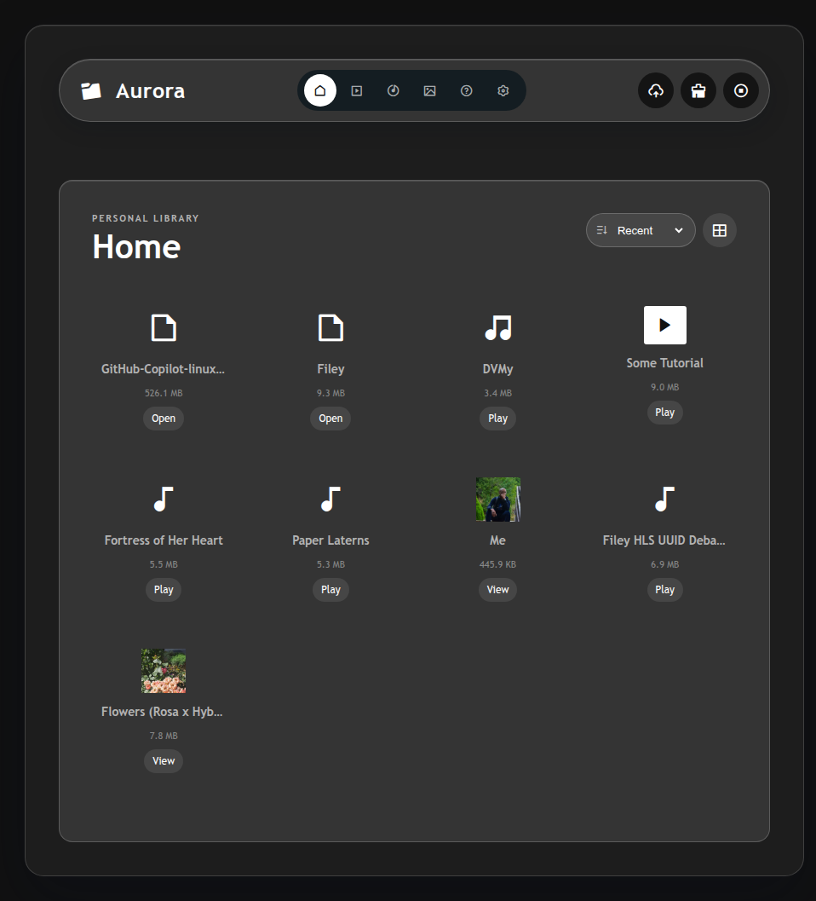
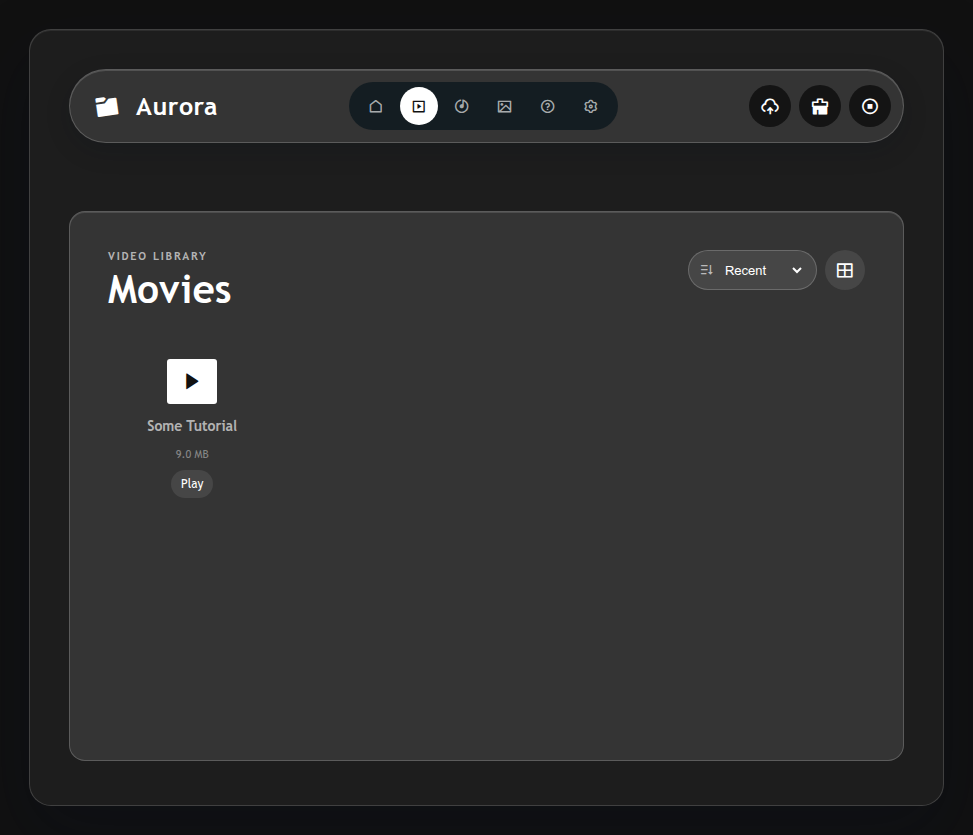
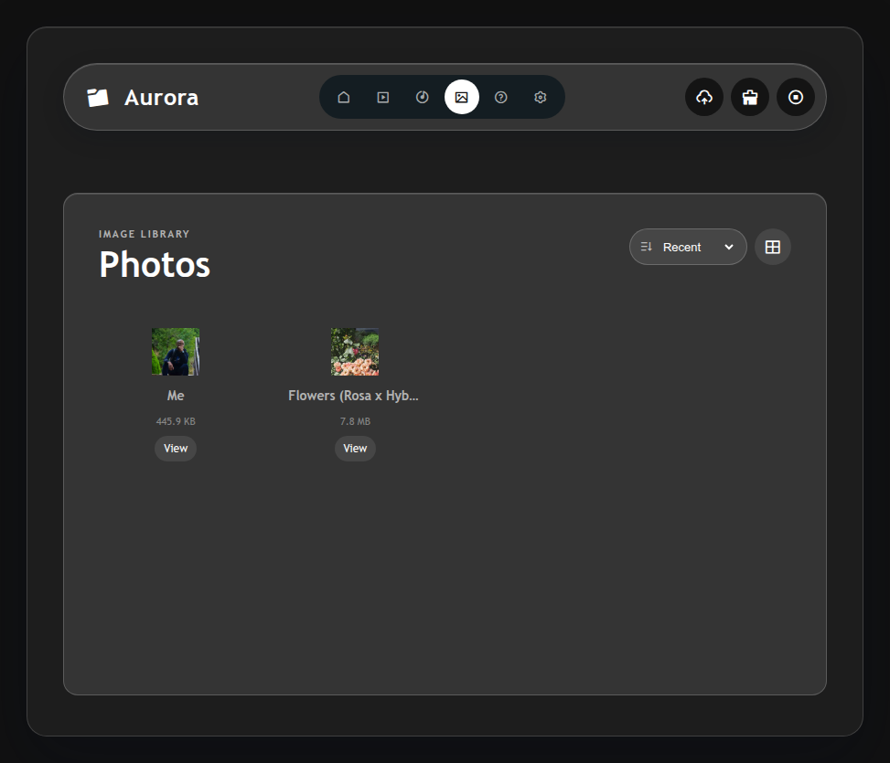
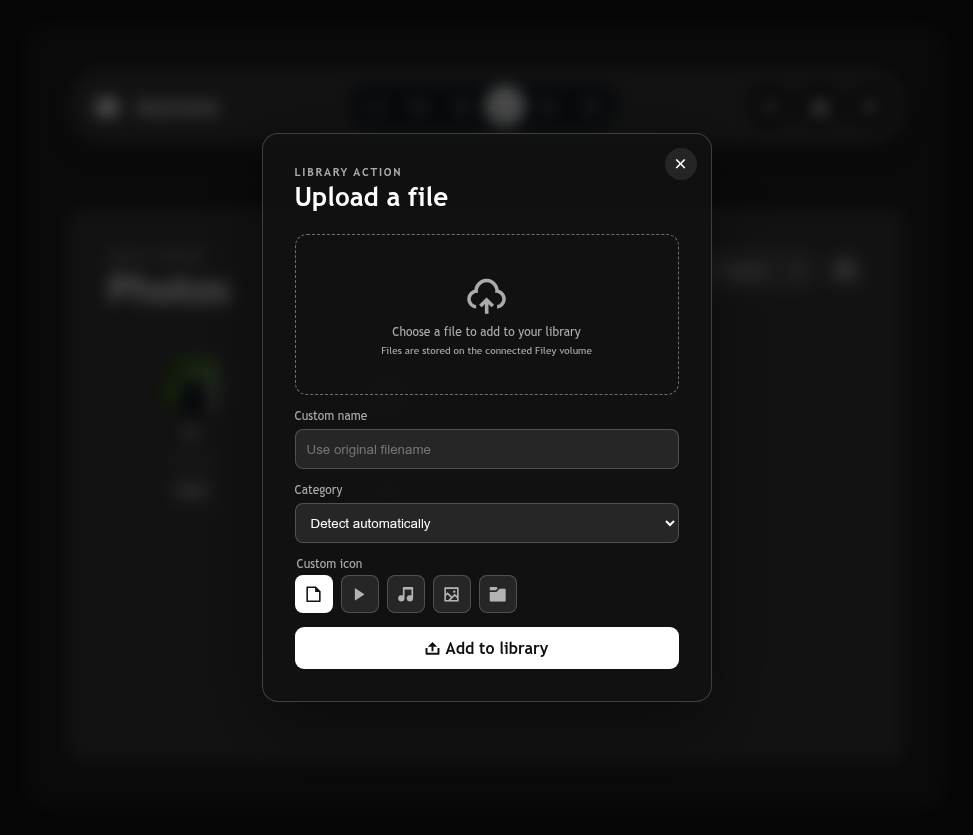
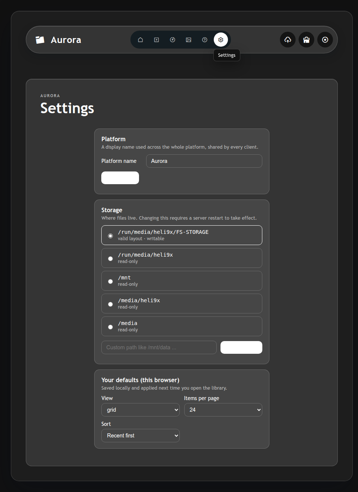

# Filey

## Your media library, on your own storage

Filey is a self-hosted personal media library for browsing, playing, and managing the files you keep on your own server. It brings movies, music, photos, and other files into one focused browser interface without requiring a hosted media account.

[Install the Linux server](deployment/linux/server/README.md) · [Read production operations](deployment/linux/server/PRODUCTION.md) · [Review the deployment overview](deployment/README.md)

## Why Filey

- **Keep control of your library.** Store media on a machine you manage and access it from a browser on your network.
- **Browse without sorting everything by hand.** Filey separates movies, music, photos, and other files into focused library views.
- **Play more of what you already have.** Browser-compatible media can stream directly; FFmpeg-backed HLS conversion supports formats that need processing.
- **Manage files in place.** Upload, rename, download, and delete files from the same interface.
- **See the shape of your storage.** The settings view exposes file counts, cache usage, free space, and the active storage location.

## The everyday workflow

1. **Connect your storage.** Point the server at the directory that contains your media.
2. **Open a library.** Start at Home or move directly to Movies, Music, or Photos.
3. **Choose how to browse.** Switch between grid and list views, then sort by name, date, size, or type.
4. **Open or manage a file.** Play supported media, upload something new, rename an item, or download it.
5. **Keep the server tidy.** Clean generated library data or stop active conversions from the navigation actions.

## Feature guide

### Browse by media type

The Home view gives you a unified library, while dedicated Movies, Music, and Photos views make larger collections easier to scan. Pagination keeps the interface usable as the library grows.

### Grid or list, depending on the moment

Use the visual grid for quick recognition or the compact list when filenames and file details matter. Sort the current library by default order, newest, oldest, A-Z, Z-A, size, or type.

### Upload and manage

The upload flow accepts files through a drop zone, lets you name and categorize an upload, and reports progress in the interface. Context actions provide rename, download, and delete operations for existing files.

### Playback with format conversion

Common browser-compatible media can play directly. When a format needs preparation, Filey can create an HLS stream through FFmpeg, reuse the generated cache on later playback, and stop active conversions from the navigation bar.

### Storage visibility

Settings show the active storage directory, file counts by category, generated HLS cache usage, and available disk space. The platform name can also be customized for the devices that connect to the server.

## Product screenshots

The [full screenshot index](docs/screenshots.md) documents the live interface. These representative captures cover the library overview, media categories, upload flow, file actions, settings, and in-app guide.



| Movies | Photos |
| --- | --- |
|  |  |





Keep filenames, hostnames, and storage paths synthetic or approved before publishing these images externally.

## Install on Linux

The deployment installer prepares a Debian/Linux server with Python, FFmpeg, a virtual environment, and a systemd service. From the deployment directory:

```bash
cd deployment/linux/server
FILEY_STORAGE_DIR=/mnt/media FILEY_BIND=0.0.0.0:9100 ./install.sh
```

Useful service commands:

```bash
systemctl status filey-server
systemctl restart filey-server
journalctl -u filey-server -f
```

For local development, run `./start.sh` from any directory. It uses the Filey-01 virtual environment and keeps the server process in the foreground so startup errors are returned to the shell.

Read the [Linux server guide](deployment/linux/server/README.md) for installation details and the [production guide](deployment/linux/server/PRODUCTION.md) before exposing a server beyond a trusted network.

## Technical note

Filey is currently designed as a self-hosted personal library rather than a multi-user collaboration service. It does not provide public sharing links or built-in account authentication, so deployment should be restricted to a trusted network or protected by an appropriately configured reverse proxy. FFmpeg is required for media conversion and generated thumbnails. Changing the storage location may require a server restart.

## Project layout

- `Filey-01/` - the browser client and Python server
- `deployment/linux/server/` - Linux installation and service files
- `deployment/linux/client/` - standalone client deployment notes
- `deployment/android/` - Android deployment preparation
- `deployment/api/` - shared OpenAPI contract

## Status

Filey is an active project. The interface and deployment materials are evolving together; verify the deployment notes and environment requirements before using it with important data.
