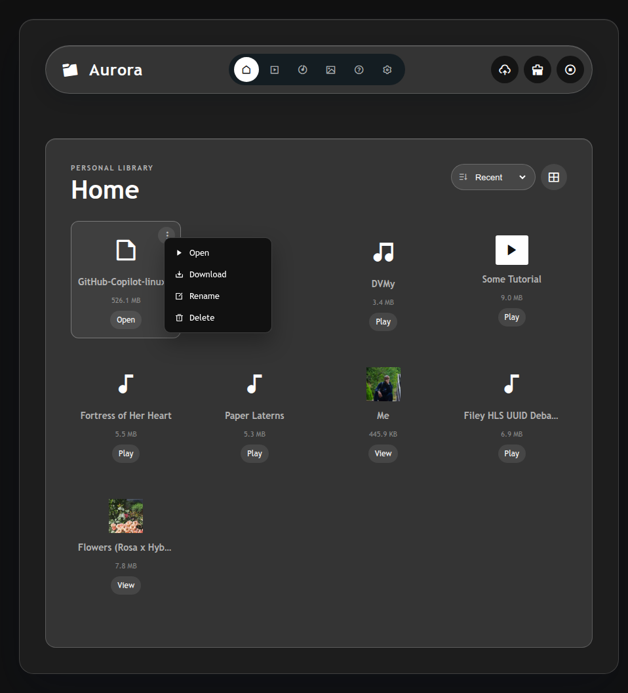
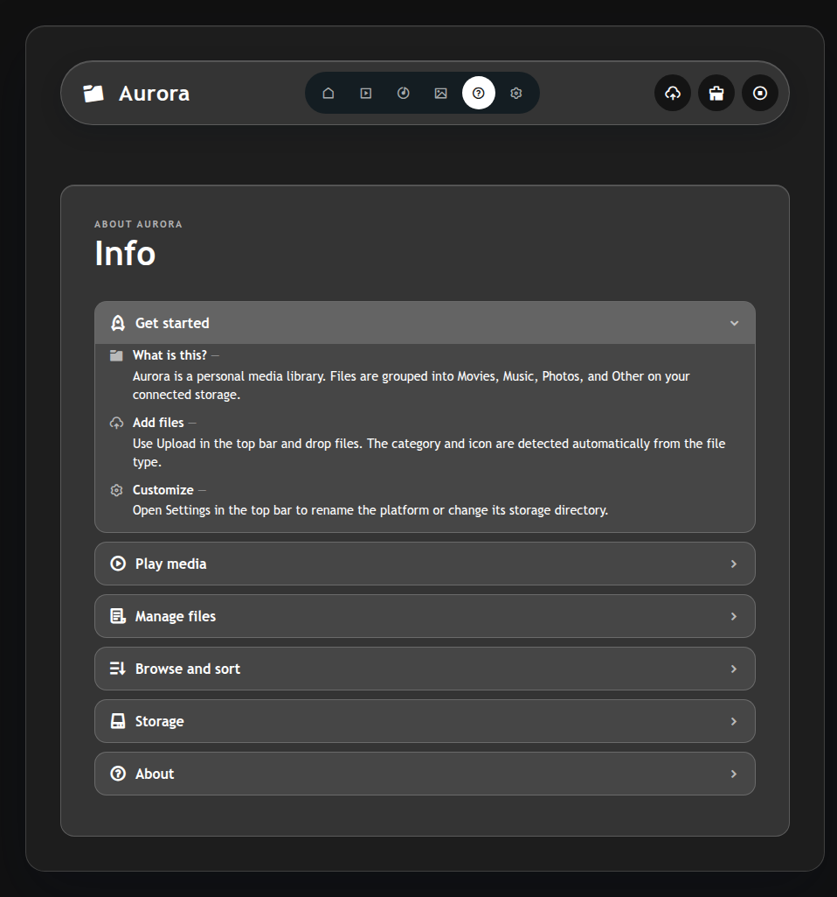

# Filey: a private media library for your own server

## A calmer way to browse what you already own

Filey turns a folder on your server into a focused personal library for movies, music, photos, and everything else worth keeping close.

No hosted media account. No rearranging your storage to fit someone else's system. Just a browser interface built around your files.

## What users can do

### Browse by intent

Open the complete library from Home or jump straight to Movies, Music, or Photos. Dedicated views make a large collection easier to scan.

### Find the right view

Switch between a visual grid and a compact list. Sort by newest, oldest, name, size, or type, then move through the collection with pagination.

### Play what is ready

Browser-compatible media can stream directly. When a file needs processing, FFmpeg-backed HLS conversion prepares it for playback and can reuse the generated cache later.

### Manage without leaving the library

Upload through a drop zone, rename files, download a copy, or delete an item from its context actions. The interface keeps the common file operations close to the content.

### Understand storage at a glance

Settings bring together the active storage path, file counts by category, HLS cache usage, and available disk space. Customize the platform name for the people and devices on your trusted network.

## Product screenshots

Use one consistent browser viewport and synthetic media names in the final brochure. The [complete screenshot index](screenshots.md) includes the capture notes and the full set of documented UI states.

| A focused collection | A visual gallery |
| --- | --- |
|  |  |

## A simple start

1. Install the Linux server and point it at your media directory.
2. Open Filey from a browser on your trusted network.
3. Browse, play, and manage your library from one place.

[Linux installation guide](../deployment/linux/server/README.md) · [Production operations](../deployment/linux/server/PRODUCTION.md)

## Technical note

Filey is a self-hosted personal library. It does not currently provide user accounts, public sharing links, or built-in authentication. Protect deployments with a trusted network or a properly configured reverse proxy. FFmpeg is needed for format conversion and generated photo thumbnails, and changing the storage directory may require a server restart.
